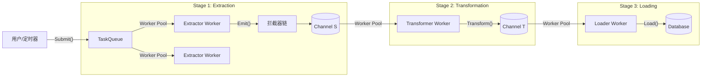

# Go-ETL Pipeline

[](https://www.google.com/search?q=https://pkg.go.dev/github.com/eruca/etl)
[](https://www.google.com/search?q=https://goreportcard.com/report/github.com/eruca/etl)

**Go-ETL** 是一个为 Go 语言设计的高性能、类型安全、模块化的 ETL (Extract-Transform-Load) 框架。

它利用 Go 泛型 (`Generics`) 和 Goroutine 工作池 (`Worker Pools`) 模式，允许开发者独立控制每个处理阶段的并发度。它既支持一次性批处理任务，也支持作为常驻服务动态接收任务。

## ✨ 核心特性

  * **🛡 类型安全**: 基于 Go 泛型 `[S, T]`，在编译期保证源数据 (`Source`) 和目标数据 (`Target`) 的类型一致性。
  * **🚀 全链路并发控制**: 提取 (`Extract`)、转换 (`Transform`)、加载 (`Load`) 三个阶段均采用独立的 Worker Pool，可根据 IO/CPU 密集型特征分别调优。
  * **🔌 插件化架构**: 业务逻辑完全解耦，只需实现简单的接口。
  * **⚡️ 动态任务分发**: 支持在运行时动态提交新的提取任务 (`Submit`)，适合构建长期运行的爬虫或同步服务。
  * **🧅 中间件拦截器**: 支持 AOP 风格的 `EmitterInterceptor`，轻松实现日志记录、数据校验、流控和去重。
  * **🛑 优雅退出**: 基于 `Context` 的取消机制，确保在关闭服务时数据不丢失、资源被正确释放。

## 🏗 架构概览



## 📦 安装

```bash
go get github.com/eruca/etl
```

## 🚀 快速开始

假设我们要构建一个简单的管道：

1.  **Extract**: 生成一批数字 ID (String)。
2.  **Transform**: 将 ID 转换为 User 结构体 (Struct)。
3.  **Load**: 打印到控制台 (模拟入库)。

### 1\. 定义数据类型

```go
type SourceData []string // 批量的 ID
type TargetData []User   // 批量的用户模型

type User struct {
    ID   string
    Name string
}
```

### 2\. 实现组件接口

```go
import (
    "context"
    "fmt"
    "github.com/eruca/etl"
)

// --- Extractor ---
type MyGenerator struct {
    Count int
}

func (g *MyGenerator) Extract(ctx context.Context, emit etl.Emitter[SourceData]) error {
    // 模拟生成 10 批数据
    for i := 0; i < g.Count; i++ {
        batch := []string{fmt.Sprintf("ID-%d", i), fmt.Sprintf("ID-%d-Copy", i)}
        emit.Emit(batch) // 发送给下一步
    }
    return nil
}

// --- Transformer ---
type MyTransformer struct {}

func (t *MyTransformer) Transform(ctx context.Context, src SourceData) (TargetData, error) {
    var users TargetData
    for _, id := range src {
        // 模拟数据转换/API调用
        users = append(users, User{ID: id, Name: "User_" + id})
    }
    return users, nil
}

// --- Loader ---
type MyLoader struct {}

func (l *MyLoader) Load(ctx context.Context, item TargetData) error {
    fmt.Printf("Saving batch of %d users...\n", len(item))
    return nil
}
```

### 3\. 组装并运行

```go
func main() {
    ctx := context.Background()

    // 创建 Pipeline
    pipeline := etl.New[SourceData, TargetData](
        &MyTransformer{},
        &MyLoader{},
        // 配置并发参数
        etl.WithExtractConcurrency[SourceData](2),  // 2个并发生成
        etl.WithTransformConcurrency[SourceData](5), // 5个并发转换
        etl.WithLoadConcurrency[SourceData](2),      // 2个并发入库
        etl.WithBufferSize[SourceData](100),         // Channel 缓冲
    )

    // 在后台运行 Pipeline
    go func() {
        if err := pipeline.Run(ctx); err != nil {
            panic(err)
        }
    }()

    // 动态提交任务
    pipeline.Submit(&MyGenerator{Count: 50})

    // 等待任务完成 (示例中简单 sleep，生产环境应使用 Signal 或 WaitGroup)
    time.Sleep(2 * time.Second)
    pipeline.Shutdown()
}
```

-----

## 🛠 高级用法

### 1\. 使用拦截器 (Interceptors)

拦截器允许你在 Extractor 发出数据前进行处理，例如**日志记录**或**空值过滤**。我们提供了 `EmitterFunc` 辅助函数来简化开发。

```go
// 日志拦截器
func LogInterceptor(next etl.Emitter[[]string]) etl.Emitter[[]string] {
    return etl.EmitterFunc[[]string](func(batch []string) {
        fmt.Printf("[Log] Extracted batch size: %d\n", len(batch))
        next.Emit(batch) // 继续传递
    })
}

// 过滤空批次拦截器
func FilterEmptyInterceptor(next etl.Emitter[[]string]) etl.Emitter[[]string] {
    return etl.EmitterFunc[[]string](func(batch []string) {
        if len(batch) == 0 {
            return // 丢弃，不调用 next
        }
        next.Emit(batch)
    })
}

// 使用
pipeline := etl.New(..., 
    etl.WithEmitterInterceptor(LogInterceptor, FilterEmptyInterceptor),
)
```

### 2\. 解决并发重复问题 (In-Flight Dedup)

在爬虫或同步场景中，多个 Extractor 可能抓取到相同的 ID。可以在业务层引入去重缓存。

```go
type SafeSearcher struct {
    Dedup *sync.Map // 共享的去重缓存
}

func (s *SafeSearcher) Extract(ctx context.Context, emit etl.Emitter[string]) error {
    ids := searchAPI()
    for _, id := range ids {
        // 使用 LoadOrStore 进行并发安全的去重
        if _, loaded := s.Dedup.LoadOrStore(id, true); !loaded {
            emit.Emit(id) // 只有第一次遇到的 ID 才会发射
        }
    }
    return nil
}
```

### 3\. 动态服务模式 (Daemon Mode)

将 Pipeline 作为常驻服务运行，通过 API 或定时器触发任务。

```go
// 启动服务
go pipeline.Run(ctx)

// 模拟定时任务触发
go func() {
    ticker := time.NewTicker(1 * time.Hour)
    for range ticker.C {
        // 动态提交新任务
        pipeline.Submit(&HourlySyncTask{Time: time.Now()})
    }
}()

// 优雅关闭
<-sigCh // 等待系统信号
pipeline.Shutdown() // 停止接收新任务，处理完现有任务后退出
```

## ⚙️ 配置选项

| Option | 描述 | 默认值 |
| :--- | :--- | :--- |
| `WithExtractConcurrency(n)` | 设置并行执行 Extractor 任务的 Worker 数量 | 1 |
| `WithTransformConcurrency(n)` | 设置并行执行 Transform 的 Worker 数量 | 1 |
| `WithLoadConcurrency(n)` | 设置并行执行 Load 的 Worker 数量 | 1 |
| `WithBufferSize(n)` | 设置各阶段之间 Channel 的缓冲区大小 | 10 |
| `WithTaskQueueSize(n)` | 设置待处理任务队列的大小 | 100 |
| `WithEmitterInterceptor(fn)` | 添加发射器拦截器 (中间件) | None |

## 📄 License

MIT